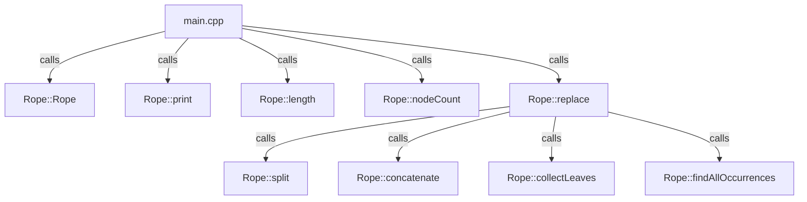

# cppRopeSTL

## Overview
cppRopeSTL is a C++ implementation of the Rope data structure, which is used for efficient string manipulation. This implementation supports various operations such as printing, concatenation, and replacement of substrings.

## How to Use

1. **Download the Files**
   - Download `rope.h` and `rope.cpp` from the repository.

2. **Include in Your Project**
   - Place `rope.h` in the `include` directory.
   - Place `rope.cpp` in the `src` directory.

3. **Include in Your Main File**
   - In your main C++ file, include the header file:
     ```cpp
     #include "rope.h"
     ```

4. **Compile and Run**
   - Compile your project using a C++ compiler:
     ```sh
     g++ -I include -o main src/rope.cpp main.cpp
     ```
   - Run the executable:
     ```sh
     ./main
     ```

## Example Usage

```cpp
#include <iostream>
#include "rope.h"

int main()
{
    Rope rope("Hello, World! this is a test to try the multi node feature. this is of the rope data structure");
    rope.print(); // Should print the entire string
    std::cout << "String Count: " << rope.length() << "\nNode Count: " << rope.nodeCount() << std::endl;
    rope.replace("this ", "Universe ");
    rope.print(); // Should print the entire string with "this" replaced by "Universe"
    std::cout << "String Count: " << rope.length() << "\nNode Count: " << rope.nodeCount() << std::endl;

    return 0;
}
```

## Function Flow Diagram



## Functions

- **Rope::Rope(const std::string &str)**
  - Constructor that initializes the Rope with the given string.

- **void Rope::print()**
  - Prints the entire string stored in the Rope.

- **int Rope::length()**
  - Returns the total length of characters in the Rope.

- **int Rope::nodeCount()**
  - Returns the total number of nodes in the Rope.

- **void Rope::replace(const std::string &oldStr, const std::string &newStr)**
  - Replaces all occurrences of `oldStr` with `newStr` in the Rope.

- **void Rope::split(std::shared_ptr<RopeNode> node, int index, std::shared_ptr<RopeNode> &leftPart, std::shared_ptr<RopeNode> &rightPart)**
  - Splits the Rope at the given index into left and right parts.

- **std::shared_ptr<RopeNode> Rope::concatenate(std::shared_ptr<RopeNode> left, std::shared_ptr<RopeNode> right)**
  - Concatenates two Rope nodes.

- **void Rope::collectLeaves(std::shared_ptr<RopeNode> node, std::vector<std::string> &leaves)**
  - Collects all leaf nodes' data into a vector.

- **std::vector<int> Rope::findAllOccurrences(const std::string &oldStr)**
  - Finds all occurrences of `oldStr` in the Rope and returns their positions.